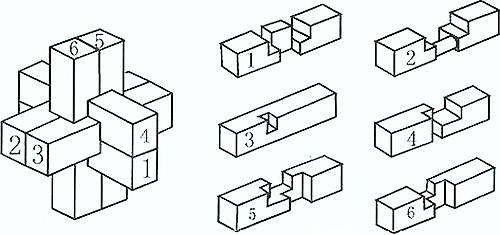
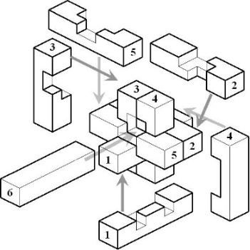
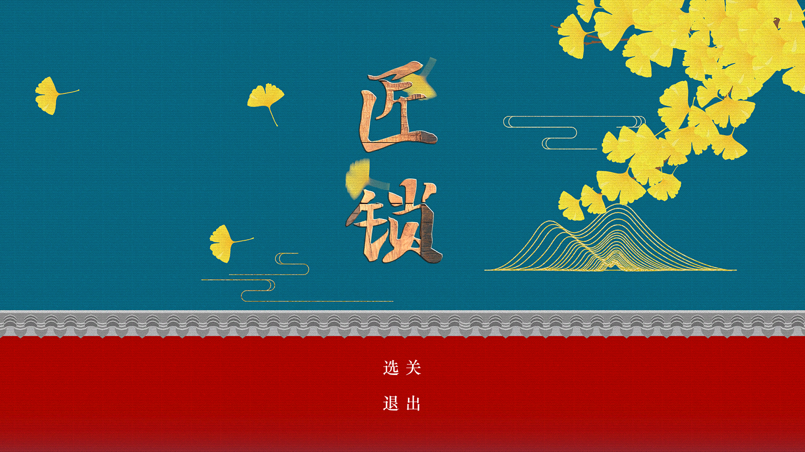
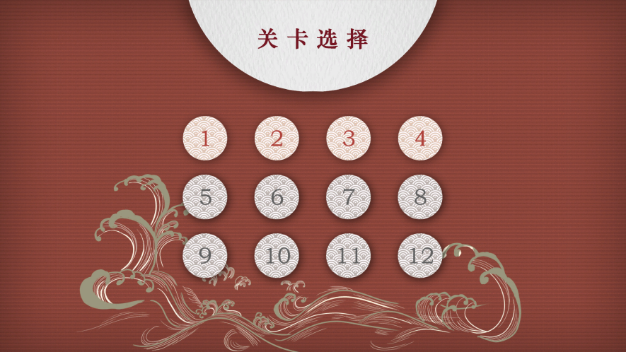
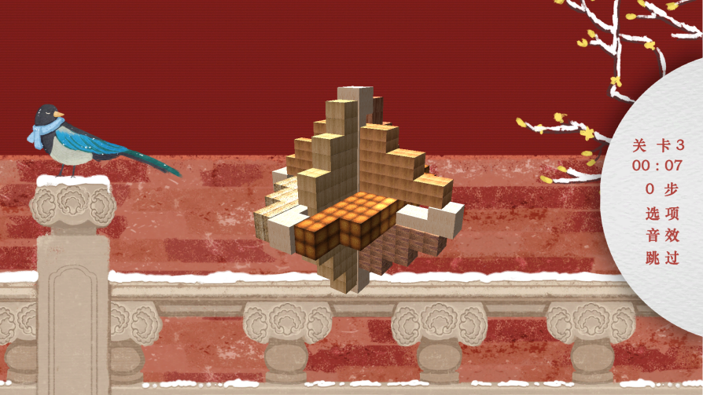
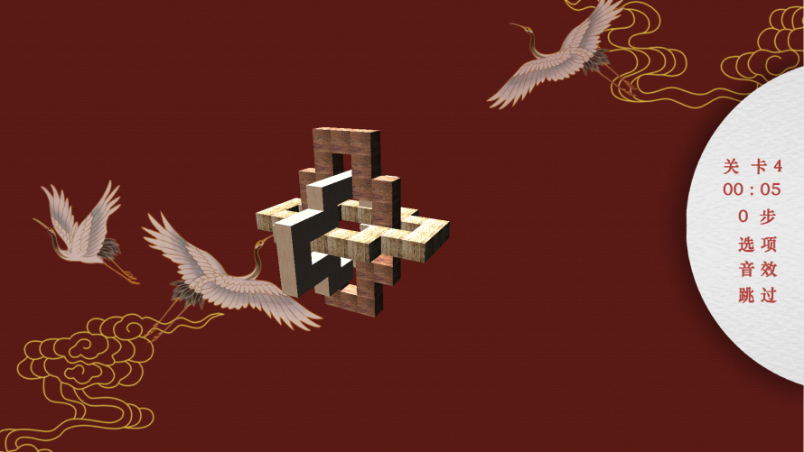

# 匠锁 Interlocked 

## 简介  

《匠锁Interlocked》属于解谜游戏，游戏主体为中国古代民族传统的土木建筑固定结合器**鲁班锁**（又名孔明锁、莫奈何，起源于古代中国建筑的榫卯结构）。玩家通过3D拖拽锁体不同部分将其从整体中分离出来，从而解开鲁班锁。

​	从预期成果上看，游戏将尽最大可能拟物，向玩家展示诸如经典六柱（下左图示）等传统鲁班锁，并通过几何体材质、滑动音效、光照等方面带给玩家尽可能真实的体验。

​	从工程过程上看，项目将通过自定义中间文件、模块松耦合开发等方式尽可能保证较高的可扩展性与可维护性。

   &nbsp;&nbsp;

## 预览  

## 团队成员 

@[Ian Li](https://github.com/IanLi1999) 
@[BY-Tang](https://github.com/BYTang314) 
@[StardustJK](https://github.com/StardustJK) 
@[lxmbjt](https://github.com/lxmbjt) 